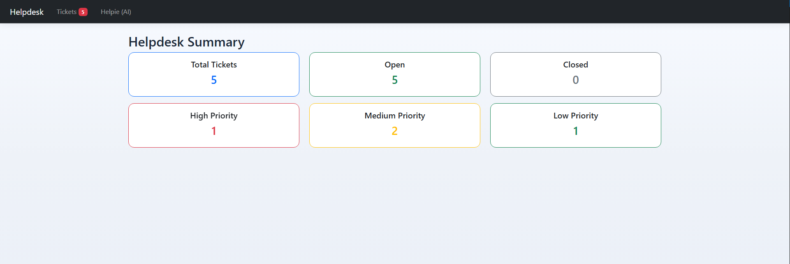
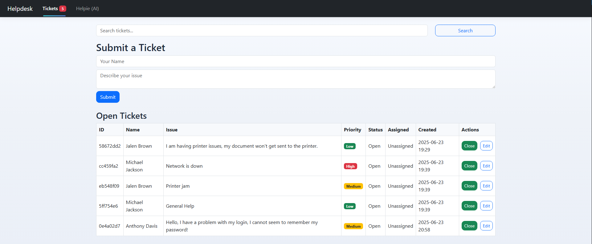
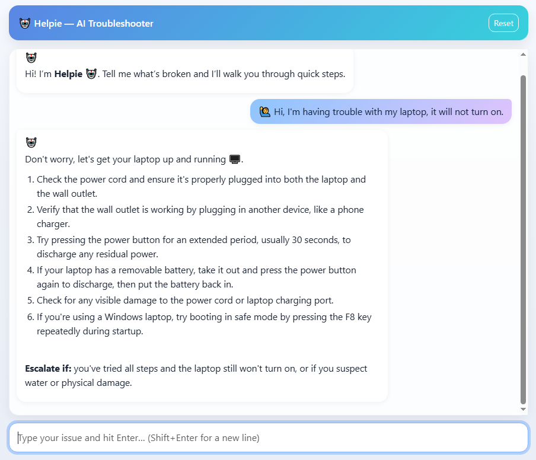

# AI Helpdesk & Ticketing Platform  

A professional **Flask-based IT helpdesk web application** featuring ticket management, a real-time dashboard, and an **AI-powered troubleshooting assistant**.  

The platform simulates a real Tier-1 helpdesk environment where users can submit issues, track ticket status, and interact with an AI chatbot. The AI is **specifically tuned for IT support inquiries only** (e.g., device, login, network, and software troubleshooting) and will not respond to off-topic questions.  

🌐 **Website:** https://ai-helpdesk-ticketing-platform.onrender.com  

---

## 📸 Preview  

**Dashboard**  
  

**Tickets**  
  

**AI Chat**  
  

---

## 🚀 Features  

- **Ticketing System** – Submit, search, edit, assign, and close tickets with automatic priority tagging (High / Medium / Low).  
- **Dashboard Analytics** – Real-time counts of total, open, closed, and priority-level tickets.  
- **AI Chatbot ("Helpie")** – Provides structured troubleshooting steps for IT issues only (power, Wi-Fi, login, printer, etc.).  
- **Professional UI** – Responsive Bootstrap 5 design with custom styling.  

---

## 🛠 Tech Stack  

- **Backend:** Python (Flask)  
- **Frontend:** Jinja2, Bootstrap 5, custom CSS  
- **Data:** JSON-based storage for ticket persistence  
- **AI Integration:** External LLM API with prompt tuning for IT helpdesk scenarios  
- **Hosting:** Render (cloud deployment)  

---

## 📫 Contact  

For questions or feedback: **ashfaqkhan900@outlook.com**  
